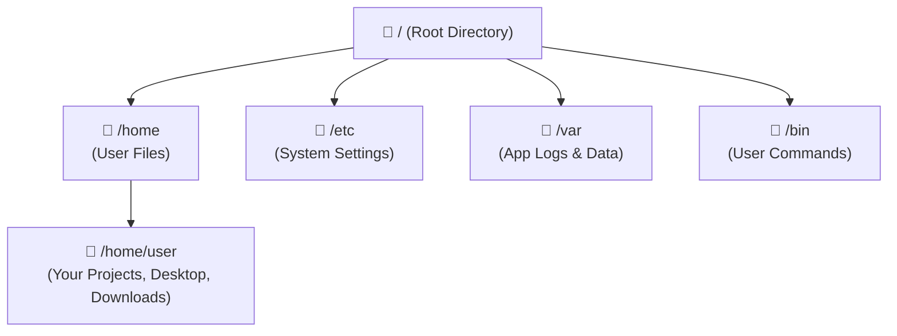
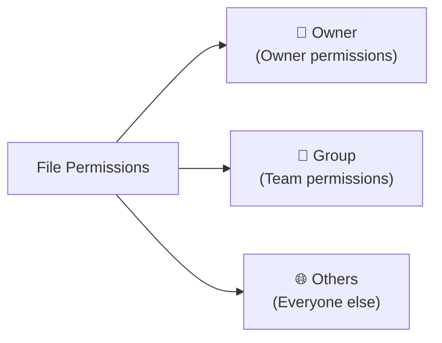
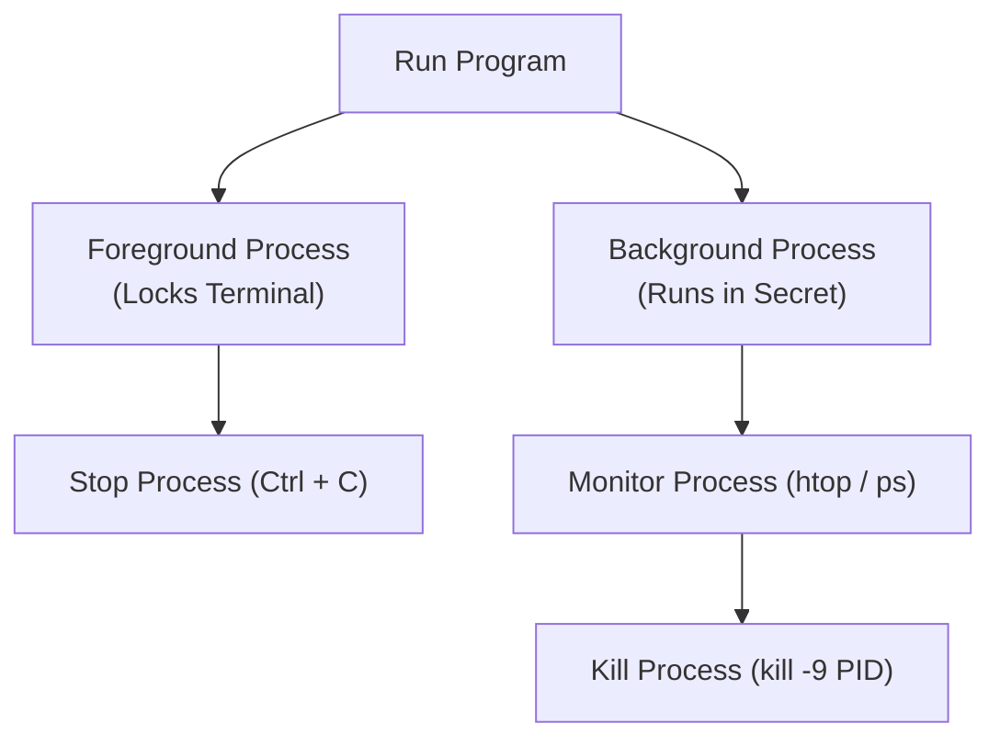

# 🧱 The Linux Foundation

Now that you know your destination, it is time to build your foundation. 

> [!IMPORTANT]
> **"Clarity before Complexity. Don't learn everything—learn what matters for your journey."**

### 🔥 Igniting the Fire: Our Philosophy

This roadmap is a guide, but **a map cannot light a fire.** 

Our goal is not to make you memorize dry terminal command lists or systemd configurations. Our goal is to **ignite your curiosity**. Once you are curious and understand where you fit in the ecosystem, you will walk the path on your own. This file cannot carry that spark—you have to.

This is our core **Learning OS** for everything we build and study:
1.  **Collapse the surface area:** Strip away the massive scope of the subject.
2.  **Find your trail:** Focus only on what is needed for today's goal.
3.  **Ignore the rest:** Actively discard the noise.

---

## 🧭 The Learning Loop

Every capability below is structured around this loop. Do not just memorize commands; understand the problem first.

```
Understand the Problem ──► Learn the Concept ──► Apply the Command ──► Verify Success
```

---

## 🛡️ 1. System Control

### ❓ The Problem: *How do I perform administrative tasks without breaking the system?*

Imagine you share a laptop with a curious kid. If they accidentally run a command that wipes the hard drive, your system is gone. Linux prevents this by locking system settings behind a digital gate. You are a regular citizen by default; you only become a superuser when you explicitly type a magic prefix.

To keep your computer secure, Linux separates normal actions (browsing, coding) from system-altering actions (installing drivers, changing filesystems).

*   **👤 Normal User:** Your default account. It has full control over your `/home` folder, but cannot modify the operating system itself.
*   **👑 Root (Superuser):** The administrator account. It has absolute power. It can modify or delete any file on the system.
*   **⚡ sudo (Superuser Do):** A command that temporarily grants your normal user account administrator privileges for a single command.

> [!WARNING]
> **Never run commands with `sudo` unless you understand exactly what they do.** A mistake with root privileges can delete your entire system.

```bash
# Safely check system updates using sudo
sudo apt update
```

---

## 📁 2. Navigating the Filesystem

### ❓ The Problem: *How does Linux organize files, and how do I move around without a mouse?*

You open a terminal, and it's just a blank screen. Where are you? How do you step into your Projects folder or view a script? In a graphical interface, you double-click folders. In the terminal, you walk through the system using keyboard steps. Think of it like textual teleportation.

In Windows, every drive is a letter (`C:\`, `D:\`). In Linux, **everything is a file** organized in a single tree structure starting at the **Root (`/`)**.



### 🧭 Paths to Know
*   **Absolute Path:** The full path starting from root (e.g., `/home/user/projects/script.py`).
*   **Relative Path:** A path starting from your current folder (e.g., `projects/script.py` or `../config`).
*   **`.` (Current Folder):** Represents your active directory.
*   **`..` (Parent Folder):** Represents the folder one level up.

---

### 🗺️ Mapping the Root Directory

When you stand at the Root directory (`/`), you are looking at a system organized by the **Filesystem Hierarchy Standard (FHS)**. 

To help you navigate this structure without feeling lost, we have created a dedicated interactive filesystem map.

> [!TIP]
> **Check out the files:** Head over to **[The Filesystem Map (00 - The Filesystem Map.md)](../04%20-%20Root/00%20-%20The%20Filesystem%20Map.md)** to see the visual safety levels and decode what directories like `/etc`, `/var`, and `/usr/local` do.

---

### 🛠️ The Commands
| Command | What it does | Example |
| :--- | :--- | :--- |
| `pwd` | Print Working Directory (Where am I?) | `pwd` |
| `cd` | Change Directory (Go to another folder) | `cd /etc` |
| `ls` | List files and folders in the current directory | `ls -la` |
| `mkdir` | Make Directory (Create a folder) | `mkdir projects` |
| `cp` | Copy a file or folder | `cp file.txt backup/` |
| `mv` | Move or rename a file or folder | `mv file.txt new_name.txt` |
| `rm` | Remove (delete) a file | `rm temp.txt` (use `-r` for folders) |

---

## 📦 3. Installing Software

### ❓ The Problem: *How do I install applications securely without downloading suspicious installers?*

On Windows or macOS, installing software usually means searching Google, downloading a setup wizard, dodging malware checkboxes, and clicking 'Next' five times. On Linux, you just state the name of the tool you want, and the system fetches and installs it securely in 3 seconds.

In Linux, you don't search the web for `.exe` or `.pkg` installers. Instead, you use a **Package Manager**—a built-in app store that pulls verified software directly from official community servers called **Repositories**.

### 🛠️ The Commands (Debian/Ubuntu/Mint Systems)
*   **Update lists:** Synchronize your local package manager lists with online servers.
    ```bash
    sudo apt update
    ```
*   **Install software:** Download and configure a program.
    ```bash
    sudo apt install git
    ```
*   **Upgrade packages:** Apply safety patches and updates to installed software.
    ```bash
    sudo apt upgrade
    ```

---

## 🐍 4. Development Environments

### ❓ The Problem: *How do developers keep different project libraries from clashing?*

You are working on two Python projects. Project A was built two years ago using an old library version. Project B uses the absolute latest version. If you install the new version globally, Project A breaks. Virtual environments let you create isolated "rooms" for each project so they never step on each other's toes.

If Project A needs Python Library v1.0 and Project B needs v2.0, installing them globally breaks your projects. Linux solves this by using isolated **Virtual Environments**.

```
System Python (Global)
  └── [ Virtual Env A (Library v1.0) ] ──► Run Project A
  └── [ Virtual Env B (Library v2.0) ] ──► Run Project B
```

### 🛠️ The Commands
*   **Create environment:** Initialize a local, isolated Python environment.
    ```bash
    python3 -m venv myenv
    ```
*   **Activate environment:** Enter the environment so package installations are isolated.
    ```bash
    source myenv/bin/activate
    ```
*   **Install libraries:** Download dependencies inside the virtual environment.
    ```bash
    pip install numpy
    ```
*   **Export dependencies:** Save all project dependencies to a text file for collaboration.
    ```bash
    pip freeze > requirements.txt
    ```

---

## 🤝 5. Version Control with Git

### ❓ The Problem: *How do developers track code edits and work together without overriding files?*

Ever worked on a project and ended up with files named `final_draft.txt`, `final_draft_v2.txt`, and `real_final_draft_FINAL.txt`? It's a mess. Git acts as a time machine for your code, taking clean snapshots of your work so you can travel back to any point in time if something breaks.

Instead of passing zip files back and forth, developers use **Git** to track file changes history and collaborate on centralized code repositories.

### 🛠️ The Commands
*   **Initialize Git:** Start tracking your current folder.
    ```bash
    git init
    ```
*   **Clone repository:** Copy a remote repository to your local machine.
    ```bash
    git clone https://github.com/user/project.git
    ```
*   **Track changes:** Add modifications to your staging area.
    ```bash
    git add file.py
    ```
*   **Commit changes:** Save a snapshot of your staged files with a summary message.
    ```bash
    git commit -m "Add core project file"
    ```
*   **Sync code:** Push local code changes online or pull the latest changes from team members.
    ```bash
    git push origin main
    git pull origin main
    ```

---

## 🐚 6. Shells and Configurations

### ❓ The Problem: *What is the terminal command line, and how do I customize my workspace?*

When you buy a car, the dashboard and seats are the cabin, but the engine under the hood does the actual work. In your terminal, the terminal emulator is the cabin (fonts, colors, windows), but the Shell is the engine processing your logic. And just like a car engine, you can tune and configure it to run faster and display custom shortcuts.

The **Terminal** is just the window wrapper. The **Shell** is the engine inside that interprets your commands.

*   **Bash (Bourne Again Shell):** The classic, reliable default shell found on almost all Linux machines.
*   **Zsh (Z Shell):** A modern, feature-rich shell with autosuggestions and themes (standard on macOS and popular on developer desktops).
*   **Fish (Friendly Interactive Shell):** User-friendly shell with autocomplete pre-configured out-of-the-box.

### ⚙️ Customization files
Every shell reads configuration scripts in your home directory when starting up. Editing these files lets you add custom colors, shortcuts (aliases), and commands.
*   For Bash: Edit `~/.bashrc`
*   For Zsh: Edit `~/.zshrc`

```bash
# Add a custom command shortcut (alias) in your configuration file
alias gs="git status"
```

---

## ✏️ 7. Text Editing in the Terminal

### ❓ The Problem: *How do I modify configuration files directly from the command line?*

Imagine you just installed Zsh, but your terminal still opens Bash. The fix? Edit one line in a hidden config file. You don't need VS Code for this—you need a 2-second terminal editor.

You do not need to launch a heavy visual editor like VS Code just to edit a 2-line config file. You can do it directly within your terminal shell.

*   **🟢 Nano:** A simple, notepad-like terminal editor. All actions (save, quit) are listed as shortcuts at the bottom of the screen.
*   **🟡 Vim:** A powerful, keyboard-driven text editor. It has a steep learning curve but is found on virtually every Linux server in the world. (Vim is a badge of honor, but stick to Nano on day one).

```bash
# Edit a configuration file using Nano
nano ~/.bashrc
```

---

## 🔐 8. Permissions and Ownership

### ❓ The Problem: *Why do I get "Permission Denied" errors, and how do I fix them?*

You wrote a Python script called `run.py`. You type `./run.py` and Linux says `Permission denied`. Nothing is broken—Linux just doesn't know you want this file to be runnable. One command fixes it.

Linux is built for multi-user security. Every file and directory has access permissions split into three categories:



Each category has three possible actions:
1.  **Read (`r` / value 4):** View file contents.
2.  **Write (`w` / value 2):** Edit or delete the file.
3.  **Execute (`x` / value 1):** Run the file (scripts or binaries).

### 🛠️ The Commands
*   **Change permissions:** Grant executable access to a script.
    ```bash
    chmod +x script.sh
    ```
*   **Change ownership:** Transfer file ownership to a user.
    ```bash
    sudo chown user:group file.txt
    ```

---

## ⚙️ 9. Process Management

### ❓ The Problem: *What happens when programs run in the background, and how do I stop frozen ones?*

Ever had a program freeze on Windows and you opened Task Manager? Linux has the same thing, but faster—you do it from the terminal.

Every application or command you run is a **Process** tracked by a unique ID called a **PID (Process ID)**.



### 🛠️ The Commands
*   **View active processes:** List running background applications.
    ```bash
    ps aux
    ```
*   **Interactive system monitor:** View CPU, memory usage, and open processes in real-time.
    ```bash
    htop
    ```
*   **Stop a frozen process:** Force-close a process using its PID.
    ```bash
    kill -9 1234
    ```

---

## 🛠️ 10. Linux Power Tools

### ❓ The Problem: *How do I handle advanced workflows without writing complex software from scratch?*

> [!NOTE]
> **Don't try to learn these today.** Bookmark this section. When you hit a real problem—like needing to search 500 log files or schedule a backup—come back here and pick the tool that solves it.

These tools solve problems that appear only after you have built real projects. Don't try to memorize them today—just remember they exist.

*   **🔍 grep:** Search text files for specific keywords instantly (e.g., searching log folders).
*   **📁 find:** Search for directories and files based on name, size, or creation date.
*   **🔀 Pipes (`|`):** Connect commands. Take the output of one command and feed it directly into another.
*   **📝 Redirection (`>`):** Write command outputs directly to a text log file instead of printing them on screen.
*   **🔗 Symlinks:** Create virtual shortcuts to files or folders located elsewhere on your system.
*   **⏰ Cron:** Schedule system scripts to run automatically at specific dates and times.
*   **🔑 SSH:** Securely log in and control a remote Linux server from your home machine.
*   **📦 Tmux:** Split your terminal screen into multiple panes and keep remote server commands running even if you lose internet connection.

---

# 🎉 Congratulations!

You now understand the Linux foundation. You can:

*   ✅ **Navigate** your system without a mouse.
*   ✅ **Install** and update verified software.
*   ✅ **Create** isolated development environments.
*   ✅ **Edit** configuration files directly in the shell.
*   ✅ **Understand** and fix permissions issues.
*   ✅ **Use Git** to track and sync your codebase.

These skills are more than enough to start building real software. Everything beyond this point is specialization. Choose your next tool based on your goals, not because someone told you to learn it.

---

## 🚀 Now you have the skills every Linux user shares...

Congratulations! You have completed the foundation. You can navigate, manage packages, isolate programming runs, edit text files, trace process loads, control permissions, and track code changes using Git.

Your bicycle balance is solid. You are ready to build your custom developer toolkit.

Head over to **[The Developer Toolkit (00 - Choosing Your Toolkit.md)](../03%20-%20Developer%20Toolkit/00%20-%20Choosing%20Your%20Toolkit.md)** to choose the terminal windows, shells, prompts, and networking tools that match your journey.
