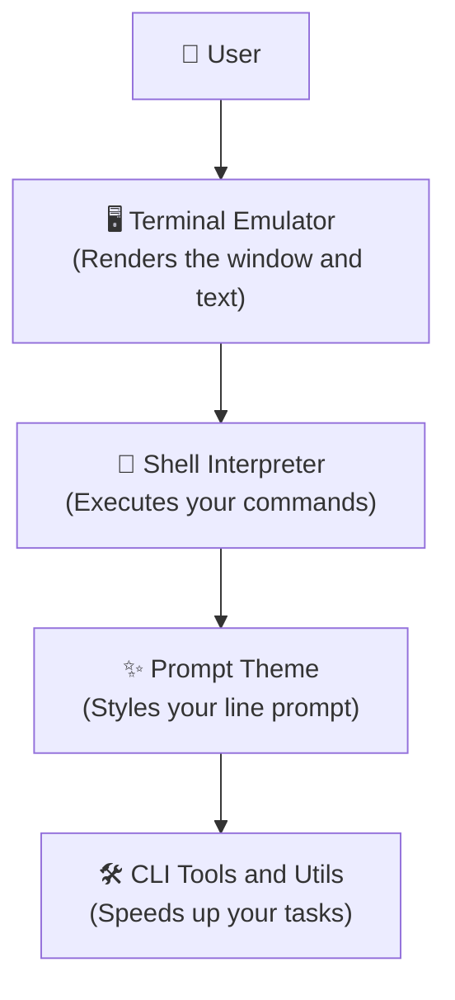

# 🛠️ The Developer Toolkit

### *Assemble your tools. Choose what matters for your journey.*

> [!IMPORTANT]
> **"Clarity before Complexity. Don't learn everything—learn what matters for your journey."**

Now that you have the skills every Linux user shares, you are ready to assemble your custom tools.

A tool is only useful when it solves an active bottleneck in your coding flow. This guide helps you understand the different layers of the terminal ecosystem and select the exact tools (terminal windows, custom shells, prompts, and search tools) you need to build your target workspace.

---

## 🧭 The Terminal Ecosystem Layers

Before installing anything, understand what you are actually customizing. The environment is split into four distinct layers:

1.  **🖥️ Terminal Emulator:** The graphical window application you open (e.g., GNOME Terminal, Kitty, Alacritty). It handles fonts, colors, and graphics rendering.
2.  **🐚 Shell Interpreter:** The command line engine running inside the window (e.g., Bash, Zsh, Fish). It processes the text commands you type.
3.  **✨ Prompt Theme:** The text prompt indicator (e.g., Starship). It displays information like your current Git branch, Python version, or system status.
4.  **🛠️ CLI Tools:** Small command line utilities (e.g., `zoxide`, `fzf`, `ripgrep`) that replace or upgrade standard commands to speed up your work.

---

## 📊 The Toolkit Matrix

Find your path below and build the recommended toolkit that matches your goals.

| Path | Terminal Emulator | Shell Interpreter | Terminal Multiplexer | Core CLI Tools |
| :--- | :--- | :--- | :--- | :--- |
| **🔰 Beginner** | GNOME Terminal (Default) | Bash | *(None)* | Standard `ls`, `cd`, `grep` |
| **💻 Software Developer** | Kitty / Alacritty | Zsh + Oh-My-Zsh | Tmux / Zellij | `zoxide`, `fzf`, `git`, `ripgrep` |
| **🤖 AI & ML Engineer** | Kitty | Zsh / Bash | Tmux | `docker`, `nvidia-smi`, `conda` |
| **☁️ SysAdmin / DevOps** | Default Terminal | Bash | Tmux | `ssh`, `htop`, `systemctl`, `journalctl` |
| **🎨 Customizer** | Kitty / Alacritty | Fish | Zellij | `starship`, `eza`, `fastfetch`, `bat` |

---

## 📂 Toolkit Guide Breakdown

Explore each section in detail to assemble your workspace:

### ⚙️ The Core Interface
*   **01. [Terminals](01%20-%20Terminals.md)** — Explains what terminal emulators are, evaluates standard vs. GPU-accelerated windows (Kitty, Alacritty, WezTerm), and clarifies visual settings.
*   **02. [Shells](02%20-%20Shells.md)** — Differentiates terminals from shells, compares Bash, Zsh, and Fish, and introduces startup configurations.
*   **03. [Developer Environment](03%20-%20Developer%20Environment.md)** — A step-by-step assembly guide to connect terminals, shells, fonts, and prompt customizers into a working setup.
*   **04. [Prompt Customization](04%20-%20Prompt%20Customization.md)** — Styles your prompt with branch indicators and system info specs using Starship and Nerd Fonts.

### 🛠️ Working in the Command Line
*   **05. [Navigation & Search](05%20-%20Navigation%20%26%20Search.md)** — Speed up directory changes and text searches using `zoxide`, `fzf`, and `ripgrep`.
*   **06. [Text Processing](06%20-%20Text%20Processing.md)** — Filter and manipulate text output streams using `jq`, `sed`/`awk`, `cut`/`sort`, and `xargs`.
*   **07. [File Utilities](07%20-%20File%20Utilities.md)** — Inspect and package folders cleanly using `bat`, `eza`, `tree`, and `zip`/`tar`.
*   **08. [System Monitoring](08%20-%20System%20Monitoring.md)** — Track processor loads, RAM allocation, GPU cores, and storage usage using `htop`, `btop`, `nvtop`, and `ncdu`.
*   **09. [Terminal Multiplexers](09%20-%20Terminal%20Multiplexers.md)** — Keep tasks running in the background and manage grids using `tmux` or `Zellij`.

### 🌐 System Specializations
*   **10. [Networking & Remote Access](10%20-%20Networking%20%26%20Remote%20Access.md)** — Securely connect to cloud servers and transfer files using `ssh`, `scp`/`rsync`, and `curl`/`wget`.
*   **11. [Package Managers](11%20-%20Package%20Managers.md)** — Understand native distro stores, sandboxed Flatpaks, and user space Homebrew packages.
*   **12. [Containers](12%20-%20Containers.md)** — Encapsulate applications and prevent runtime conflicts using Docker, Docker Compose, Podman, and Distrobox.
*   **13. [Build Tools](13%20-%20Build%20Tools.md)** — Compile human-readable source code into machine executables using GCC/Clang and Make/CMake compilers.
*   **14. [Unix Philosophy](14%20-%20Unix%20Philosophy.md)** — Learn how to construct powerful stream-processing pipelines using pipes, redirections, and text transforms.
*   **15. [Git Workflows](15%20-%20Git%20Workflows.md)** — Master the local-to-cloud commit cycle to secure and share your codebase.

---

> [!TIP]
> **Next Step:** Go to [01 - Terminals](01%20-%20Terminals.md) or follow the step-by-step setup in [03 - Developer Environment](03%20-%20Developer%20Environment.md)! Remember: only install what solves a problem for you today!
