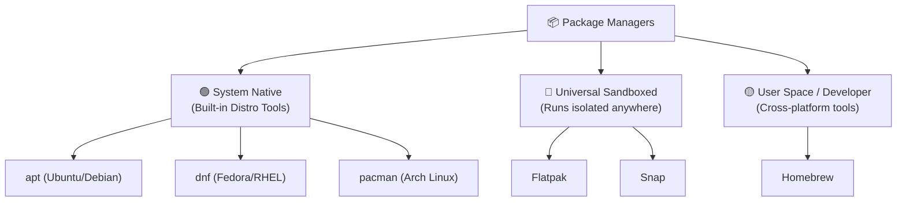

# 📦 Package Managers: Software Administration

### *How do different Linux systems find, install, and manage applications safely?*

> [!IMPORTANT]
> **"Clarity before Complexity. Don't learn everything—learn what matters for your journey."**

---

## ❓ The Problem: *Solving dependency hell and securing software installation*

In early operating systems, installing software meant downloading code, compiling it, resolving conflicts (like realizing App A needs Library v1.0 but you have v2.0 installed), and manually placing files in directories. This was called **"Dependency Hell."**

Linux solved this by introducing **Package Managers**—automated system store managers that download verified packages, resolve all their required libraries (dependencies) automatically, and apply system updates safely.

Remember downloading `.exe` files from random websites on Windows? Linux killed that. Package managers are like a verified app store built into your terminal — one command installs, updates, or removes anything safely.

---

## 🚀 The Three Package Manager Ecosystems

Depending on your Linux distribution and usage, you will interact with three main classes of package managers:



---

## 🛠️ Package Managers in Action

### 1. System Native (Apt, Dnf, Pacman)
These are integrated directly into the OS. They are lightweight, fast, and share libraries to save storage space.

*   **Apt (Debian / Ubuntu / Linux Mint):**
    ```bash
    sudo apt install git
    ```
*   **Dnf (Fedora / RedHat):**
    ```bash
    sudo dnf install git
    ```
*   **Pacman (Arch Linux / Manjaro):**
    ```bash
    sudo pacman -S git
    ```

### 2. Universal Sandboxed (Flatpak, Snap)
*   **Why they exist:** System native apps can fail if your OS is too old to support a new library version. Sandboxed formats bundle all dependencies and settings inside a single isolated container, allowing them to run on any distribution.
*   **Good for:** Desktop applications like Discord, Spotify, or Steam where you want the latest updates immediately.
*   **Example (Flatpak):**
    ```bash
    # Install Spotify via flatpak
    flatpak install flathub com.spotify.Client
    ```

### 3. User Space (Homebrew)
*   **Why it exists:** Originally built for macOS, Homebrew (`brew`) allows you to install developer utilities to your local home directory without requiring `sudo` root permissions.
*   **Example:**
    ```bash
    # Install a tool without sudo
    brew install fzf
    ```

---

## 🚀 Next Step

Head over to **[Containers (12 - Containers.md)](12%20-%20Containers.md)** to learn how developers package applications in isolated container environments to ensure they run identically on any machine.
