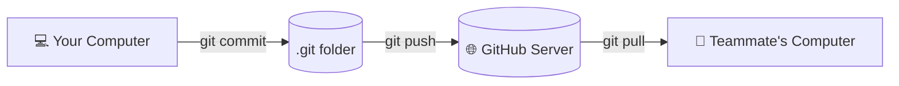

# 🌿 Git Workflows: Save & Share Your Code

### *The 4-step cycle you will use every single day to save your work and collaborate.*

> [!IMPORTANT]
> **"Clarity before Complexity. Don't learn everything—learn what matters for your journey."**

---

## ❓ The Problem: *How do I save my progress and share it with my team?*

Imagine you are training an AI model or writing a Python script. You just added 50 new lines of code that finally fixed a critical bug. 

*   *What if your laptop crashes right now?* You lose everything.
*   *What if you want to try a radical new approach, but want to retain the option to revert to your working code?*
*   *What if you need to share your code with a teammate on the other side of the world?*

**Git** is the version-control system and collaboration framework that solves all of these scenarios.

---

## 🧭 The 4-Step Daily Cycle

Every time you work, you will repeat this cycle to save your progress:

```
[ 1. Modify ] ──► [ 2. Stage (add) ] ──► [ 3. Commit (save) ] ──► [ 4. Push (share) ]
   (Write code)      (Mark files to save)    (Take a snapshot)      (Upload to GitHub)
```

### 1. Modify (Write your code)
You work on your files—creating code scripts, editing libraries, or writing files in your workspace.

### 2. Stage (`git add`)
Tell Git exactly *which* files you want to track and save in this snapshot.
```bash
# Stage a specific file
git add model.py

# Stage ALL modified files in this directory
git add .
```

### 3. Commit (`git commit -m "message"`)
Take a permanent snapshot of the staged files with a descriptive message. Think of this like a "Save Point" in a video game.
```bash
git commit -m "Fix the learning rate bug in model.py"
```
> [!TIP]
> **Pro Tip:** Write clear messages! In 6 months, you will thank yourself for writing *"Add CNN layers"* instead of *"Update stuff"*.

### 4. Push (`git push`)
Upload your local commits to a remote server (like GitHub) so they are backed up online and available to your teammates.
```bash
# Push your changes to the "main" branch on GitHub
git push origin main
```

---

## 🚀 Setting Up a New Project (Cloning)

If you are joining an existing project on GitHub, you don't start from scratch. You **Clone** (download) the repository:
```bash
# Download the entire repository to your computer
git clone https://github.com/username/project-name.git

# Move into the project folder
cd project-name
```

---

## ⚠️ The Most Common Beginner Mistake

**Situation:** You wrote code, did `git add .`, and `git commit -m "update"`, but your teammate says they can't see it on GitHub.

**Why?** Because you forgot Step 4: **Push**. `Commit` only saves it *locally* on your hard drive. `Push` uploads it to the remote server.

**Solution:** Always run `git push` after your commit to upload and share your work.

---

## 📊 The Big Picture: Where Your Code Lives



---

## 🛠️ Other Essential Git Commands

| Command | What it does | When to use it |
| :--- | :--- | :--- |
| `git status` | Check which files are modified or staged. | **Always.** Run this before adding to verify changes. |
| `git log` | View the history of your commits. | To see what changed and when in the codebase. |
| `git pull` | Download the latest changes from GitHub. | **Before you start coding** to sync teammate updates. |
| `git diff` | See the exact lines you changed. | To review your edits before staging them. |

---

## 🏆 Your Daily Ritual (Summary)

Before you leave your desk, run this 4-step sequence:

```bash
# 1. Check what you changed
git status

# 2. Add everything
git add .

# 3. Save the snapshot
git commit -m "Describe what you achieved today"

# 4. Back it up online
git push origin main
```

> **This 4-line ritual saves your work, secures it in the cloud, and is the foundation of all professional development.** 🚀

---

## 🚀 Next Step

Now that you have configured your development toolkit, head over to **[Decoding the Root Directory (00 - The Filesystem Map.md)](../04%20-%20Root/00%20-%20The%20Filesystem%20Map.md)** to explore the system folders, configuration zones, and layout directories of the Linux operating system.
