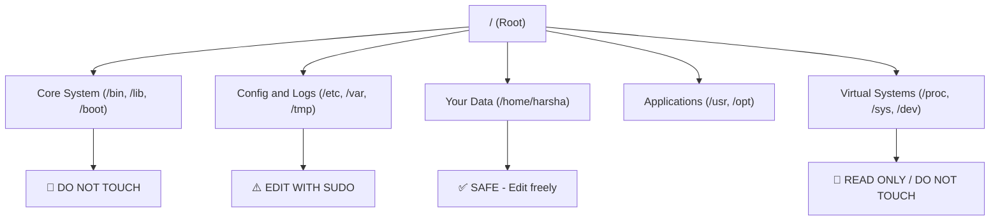

# 📁 The Filesystem Map: Decoding the Root

### *A guide to understanding how Linux organizes system folders and applications.*

> [!IMPORTANT]
> **"Clarity before Complexity. Don't learn everything—learn what matters for your journey."**

---

## ❓ The Problem: *Cryptic directories in the Root*

When you type `cd /` and then `ls`, you see a list of folder names that look like short, cryptic abbreviations: `bin`, `etc`, `proc`, `usr`, `var`...

If you don't know what these folders do, navigating is like driving through a city with no street signs. You get confused about where applications are installed, where settings are saved, and where it is safe to play.

Linux folders are organized according to a strict standard called the **Filesystem Hierarchy Standard (FHS)**. This guide splits the root directory into 5 logical zones so you can map out your system.

---

## 📊 The Golden Rule for Beginners

---

## 📂 The Filesystem Layout Breakdown

Select a specific directory zone to explore its folders in detail:

### 1. [System Core](01%20-%20System%20Core.md)
*   **`/bin` & `/sbin`:** The binaries (compiled executables) of basic CLI commands.
*   **`/lib` & `/lib64`:** Library files that applications require to run (like `.dll` files in Windows).
*   **`/boot`:** Kernel configurations and bootloader code needed to turn your PC on.

### 2. [Configuration & Logs](02%20-%20Configuration%20%26%20Logs.md)
*   **`/etc`:** System-wide settings and editable text configurations.
*   **`/var`:** Variable runtime data (e.g. system logs, databases, cache logs).
*   **`/tmp`:** Temporary file sandbox (wiped on system reboot).
*   **`/run`:** Live session metrics.

### 3. [User Files & Mounts](03%20-%20User%20Files%20%26%20Mounts.md)
*   **`/home`:** Your personal user accounts sandbox space.
*   **`/root`:** The super administrator's home folder.
*   **`/media` & `/mnt`:** Attachments points for USB drives and hard disks.

### 4. [Software & Applications](04%20-%20Software%20%26%20Applications.md)
*   **`/usr`:** Unix System Resources (largest app installation hub).
*   **`/opt`:** Third-party add-on applications (Chrome, Spotify).
*   **`/srv` & `/snap`:** Web server files and Ubuntu container runtimes.

### 5. [Virtual Systems](05%20-%20Virtual%20Systems.md)
*   **`/proc` & `/sys`:** Live processor states, system hardware, and RAM logs.
*   **`/dev`:** Special device links to your hardware (like `/dev/sda`).

---

> [!TIP]
> **Next Step:** Head over to **[01 - System Core](01%20-%20System%20Core.md)** to check where the base Linux operating system binaries live.
