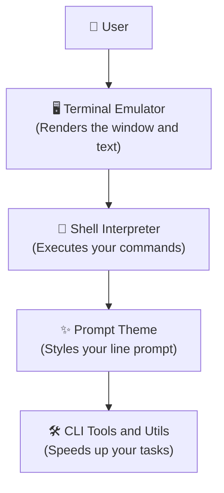

# 🛠️ The Developer Toolkit

### *Assemble your tools. Choose what matters for your journey.*

> [!IMPORTANT]
> **"Clarity before Complexity. Don't learn everything—learn what matters for your journey."**

When you see screenshots of veteran developer environments on GitHub or Reddit, they look incredibly cool—custom command lines, colored terminal panels, and fast file-search utilities. 

But you do **not** need to install all of these tools on day one. A tool is only useful when it solves an active bottleneck in your coding flow. This guide helps you understand the different layers of the terminal ecosystem and select the exact tools you need.

---

## 🧭 The Terminal Ecosystem Layers

Before installing anything, understand what you are actually customizing. The environment is split into four distinct layers:

1.  **🖥️ Terminal Emulator:** The graphical window application you open (e.g., GNOME Terminal, Kitty, Alacritty). It handles fonts, colors, and graphics rendering.
2.  **🐚 Shell Interpreter:** The command line engine running inside the window (e.g., Bash, Zsh, Fish). It processes the text commands you type.
3.  **✨ Prompt Theme:** The text prompt indicator (e.g., Starship). It displays information like your current Git branch, Python version, or system status.
4.  **🛠️ CLI Tools:** Small command line utilities (e.g., `zoxide`, `fzf`, `ripgrep`) that replace or upgrade standard commands to speed up your work.

---

## 📊 The Toolkit Matrix

Find your path below and build the recommended toolkit that matches your goals.

| Path | Terminal Emulator | Shell Interpreter | Terminal Multiplexer | Core CLI Tools |
| :--- | :--- | :--- | :--- | :--- |
| **🔰 Beginner** | GNOME Terminal (Default) | Bash | *(None)* | Standard `ls`, `cd`, `grep` |
| **💻 Software Developer** | Kitty / Alacritty | Zsh + Oh-My-Zsh | Tmux / Zellij | `zoxide`, `fzf`, `git`, `ripgrep` |
| **🤖 AI & ML Engineer** | Kitty | Zsh / Bash | Tmux | `docker`, `nvidia-smi`, `conda` |
| **☁️ SysAdmin / DevOps** | Default Terminal | Bash | Tmux | `ssh`, `htop`, `systemctl`, `journalctl` |
| **🎨 Customizer** | Kitty / Alacritty | Fish | Zellij | `starship`, `eza`, `fastfetch`, `bat` |

---

## 📂 Toolkit Guide Breakdown

Explore each layer in detail to understand why these tools exist:

### 1. [Terminals](01%20-%20Terminals.md)
Answers: *Is GNOME Terminal different from Kitty? Why does hardware acceleration matter for fonts?*
*   **GNOME Terminal:** The standard default. Reliable but basic.
*   **Kitty / Alacritty:** GPU-accelerated terminal emulators. They render fonts and themes instantly and support split windows.
*   **WezTerm / Ghostty:** Modern, highly customizable emulators written in Rust and Zig.

### 2. [Shells](02%20-%20Shells.md)
Answers: *What exactly am I typing into? What makes Fish different from Bash?*
*   **Bash:** The standard operating system default. Found everywhere.
*   **Zsh:** The standard choice for active developers. Heavily customizable with plugins (auto-completion, syntax highlighting).
*   **Fish:** Friendly, interactive shell that has autosuggestions and themes enabled right out-of-the-box.

### 3. [Prompt Customization](03%20-%20Prompt%20Customization.md)
Answers: *Why do developers have custom branch indicators and system info prints in their shell?*
*   **Starship:** A fast, cross-shell prompt customizer that styles your command line.
*   **Fastfetch:** Prints system hardware and OS specs in a visual block.
*   **Nerd Fonts:** Special font files containing developer icons (folders, git branches, locks) required to display custom themes.

### 4. [Navigation & Search Tools](04%20-%20Navigation%20Tools.md)
Answers: *How do I navigate project folders and search code faster?*
*   **zoxide:** A smarter `cd` command that remembers your frequent folders so you can jump to them instantly.
*   **fzf:** An interactive fuzzy finder that lets you search and select files from lists.
*   **ripgrep (`rg`):** An extremely fast alternative to `grep` that searches file contents for keywords in milliseconds.

### 5. [File & Text Utilities](05%20-%20File%20%26%20Text%20Tools.md)
*   **bat:** A modern alternative to `cat` that adds syntax highlighting and git diff indicators.
*   **jq:** A command-line processor for JSON data.
*   **eza:** A modern alternative to `ls` that color-codes file types and permissions.

### 6. [System Monitoring](06%20-%20System%20Monitoring.md)
*   **htop / btop:** Visually trace CPU, memory, processes, and core health.
*   **ncdu:** Track down disk usage leaks.

### 7. [Terminal Multiplexers](07%20-%20Terminal%20Multiplexers.md)
Answers: *How do I run background commands on remote servers and keep tabs open?*
*   **tmux / Zellij:** Manage multiple terminal tabs and panels inside a single window, and keep background scripts active even if you lose your SSH connection.

---

> [!TIP]
> **Next Step:** Go to [01 - Terminals](01%20-%20Terminals.md) or select the specific layer you want to explore first. Remember: only install what solves a problem for you today!
