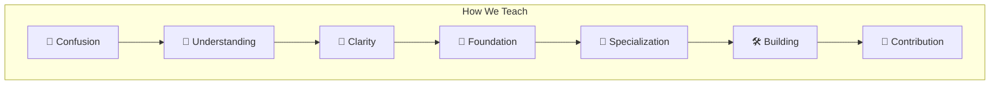
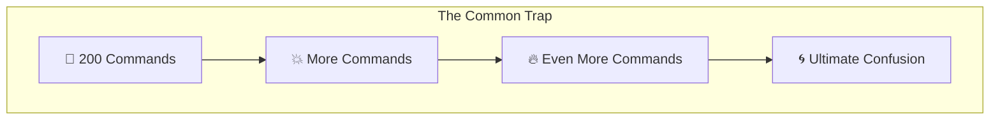

# 🐧 Welcome.

If you've just installed Linux...

Or you're thinking about switching...

Or everyone keeps telling you:

> **"Just learn Linux."**

...you are in the right place.

This repository wasn't created to teach hundreds of commands. It was created because most beginners don't quit Linux because it's hard. They quit because they don't know **where to start.**

Linux isn't one skill. It is an ecosystem. You don't need to learn everything; you only need to learn what helps you achieve **your goal.**

This repository exists to help you find that path.

> [!IMPORTANT]
> **"Clarity before Complexity. Don't learn everything—learn what matters for your journey."**

---

## 🗺️ Start Your Journey Here

We've broken this repository into three simple steps designed to build your understanding layer by layer:

1.  **🔥 [The Spark (spark.md)](file:///home/harsha/projects/foss-club/spark.md)** — *Start here.* We answer the common questions beginners actually have (What is Linux? Can I run Windows apps? Why should I switch?) and help you choose your identity.
2.  **🗺️ [The Roadmap (phase1.md)](file:///home/harsha/projects/foss-club/phase1.md)** — Once you've chosen your path, find your career track here. We tell you exactly what you need to focus on and what you can safely ignore.
3.  **🧱 [The Foundation (phase2.md)](file:///home/harsha/projects/foss-club/phase2.md)** — The hands-on workbook. Learn the 10 core capabilities (System Control, Navigation, Git, Permissions, Processes) that every Linux user shares.

---

## 💡 Learning Philosophy

We believe learning should look like this:

Not like this:

---

## 🌌 Why This Repository Exists

Because every beginner deserves someone to say:

> **"Don't worry. You don't need to learn all of Linux today."**

Someone helped us. This repository is our way of extending a hand to the next person. Maybe that's you.

---

## 🕯️ Pass the Torch

If this repository helped you understand Linux, **don't let the knowledge stop with you.** 

This is not a static notes archive—it is a community project. Improve these notes, fix mistakes, add explanations, suggest resources, or help another beginner in our issues. That is how the open-source community grows. 

Every learner can become a teacher. 🤝
