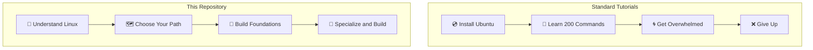
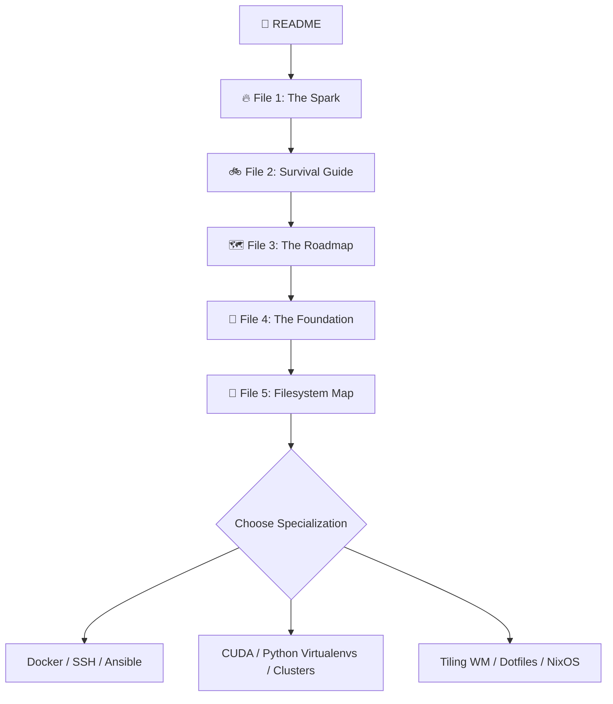
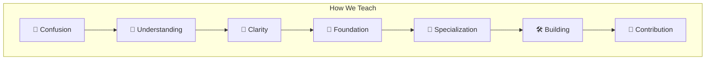
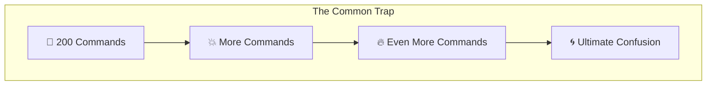

# 🐧 Linux is not hard.

# You're just looking at the whole house.

Most beginners don't quit Linux because it's difficult.

**They quit because they don't know where to start.**

This repository exists to fix that.

We don't teach you 200 commands. We teach you the **philosophy** first—so you understand *why* things work before you memorize *how*.

You don't need to learn everything. You only need to learn what helps you achieve **your goal.**

---

📂 **Your Journey:**
🔥 [Spark](01%20-%20Understanding%20Linux/01%20-%20The%20Spark.md) → 🚲 [Survival](01%20-%20Understanding%20Linux/02%20-%20The%20Linux%20Survival%20Guide.md) → 🗺️ [Roadmap](02%20-%20Building%20Your%20Foundation/01%20-%20The%20Roadmap.md) → 🧱 [Foundation](02%20-%20Building%20Your%20Foundation/02%20-%20The%20Foundation.md) → 📁 [Filesystem Map](04%20-%20Root/00%20-%20The%20Filesystem%20Map.md) → 🛠️ [Toolkit](03%20-%20Developer%20Toolkit/00%20-%20Choosing%20Your%20Toolkit.md)

---

## 🎯 Why This Repo?

Most tutorials teach commands. We teach **understanding.**

*   ✅ **No memorization drills**
*   ✅ **No command dumping**
*   ✅ **No assuming you already know things**

Instead:
*   ✅ **Start with the problem**
*   ✅ **Learn the concept**
*   ✅ **Apply the command**
*   ✅ **Verify success**

---

## 🎯 Who is this For?

*   ✅ **Students** starting their open-source journey.
*   ✅ **Software Developers** setting up coding environments.
*   ✅ **AI / ML Engineers** configuring GPUs and containers.
*   ✅ **Open Source Contributors** looking to write and debug code.
*   ✅ **Anyone** curious about taking full control of their system.

*No prior Linux experience is required.*

---

## 🧭 What Makes This Different?

Standard tutorials overwhelm you with commands before you understand why they exist. Our approach collapses the surface area first:



---

## 📂 Repository Structure

```text
📂 foss-club
├── 01 - Understanding Linux/
│   ├── 01 - The Spark.md
│   └── 02 - The Linux Survival Guide.md
├── 02 - Building Your Foundation/
│   ├── 01 - The Roadmap.md
│   └── 02 - The Foundation.md
├── 03 - Developer Toolkit/     # Practical guides for Git, tmux, zoxide, and other essential terminal tools.
├── 04 - Root/                  # Explains root directories (/etc, /usr, /proc)
└── README.md                   # Welcome page and philosophy
```

---

## 🗺️ Start Your Journey Here

We've broken this repository into six simple steps designed to build your understanding layer by layer:

1.  **🔥 [The Spark (01 - The Spark.md)](01%20-%20Understanding%20Linux/01%20-%20The%20Spark.md)** — *Start here.* We answer the common questions beginners actually have (What is Linux? Can I run Windows apps? Why should I switch?) and help you choose your identity.
2.  **🚲 [The Survival Guide (02 - The Linux Survival Guide.md)](01%20-%20Understanding%20Linux/02%20-%20The%20Linux%20Survival%20Guide.md)** — The basic command line rules of system survival. Learn how to prevent system crashes and read error messages.
3.  **🗺️ [The Roadmap (01 - The Roadmap.md)](02%20-%20Building%20Your%20Foundation/01%20-%20The%20Roadmap.md)** — Once you've chosen your path, find your career track here. We tell you exactly what you need to focus on and what you can safely ignore.
4.  **🧱 [The Foundation (02 - The Foundation.md)](02%20-%20Building%20Your%20Foundation/02%20-%20The%20Foundation.md)** — The hands-on workbook. Learn the 10 core capabilities (System Control, Navigation, Git, Permissions, Processes) that every Linux user shares.
5.  **📁 [The Filesystem Map (00 - The Filesystem Map.md)](04%20-%20Root/00%20-%20The%20Filesystem%20Map.md)** — Decode the entire filesystem tree layout, sorting standard folders into 5 visual safety layers.
6.  **🛠️ [Choosing Your Toolkit (00 - Choosing Your Toolkit.md)](03%20-%20Developer%20Toolkit/00%20-%20Choosing%20Your%20Toolkit.md)** — Choose your tools. Practical guides for terminals (Kitty), custom shells (Zsh/Starship), fast search (ripgrep/fzf), networking (SSH), containers (Docker), package managers, build tools, and Git workflows.



---

## 💡 Learning Philosophy

We believe learning should look like this:



Not like this:



---

## 🌌 Why This Repository Exists

Because every beginner deserves someone to say:

> **"Don't worry. You don't need to learn all of Linux today."**

Someone helped us. This repository is our way of extending a hand to the next person. Maybe that's you.

---

## 🤝 Our Vision & Pass the Torch

This repository is maintained by the **FOSS Club**.

We do not aim to create Linux experts overnight. We aim to help students discover their path, build confidence, contribute to open source, and eventually mentor the next generation.

If this repository helped you understand Linux, **don't let the knowledge stop with you.** 

This is not a static notes archive—it is a community project. Improve these notes, fix mistakes, add explanations, suggest resources, or help another beginner in our issues. That is how the open-source community grows. 

> [!TIP]
> **Want to Contribute?** Check out our **[Contributing Guide (CONTRIBUTING.md)](CONTRIBUTING.md)** to see how you can help fix typos, add tool guides, or make this repository even better for beginners!

> **Every learner can become a teacher.** 🕯️🤝🚀
