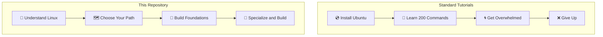
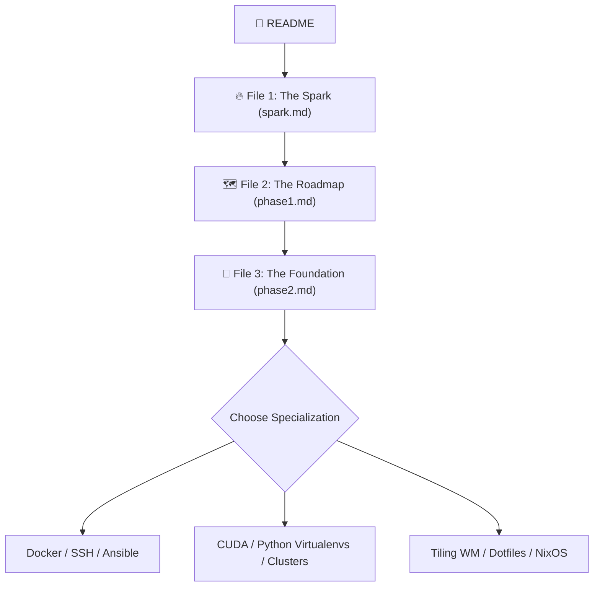

# 🐧 Linux Without the Noise

> [!IMPORTANT]
> **"Clarity before Complexity. Don't learn everything—learn what matters for your journey."**

Most Linux resources focus on memorizing commands. This repository focuses on **clarity**.

Our goal is not to make you memorize hundreds of terminal arguments. Our goal is to help you understand **why Linux exists, where it is used, which path matches your goals, and only then teach what you actually need.**

*   **Learn less.**
*   **Understand more.**
*   **Choose your own path.**

---

## 🎯 Who is this For?

*   ✅ **Students** starting their open-source journey.
*   ✅ **Software Developers** setting up coding environments.
*   ✅ **AI / ML Engineers** configuring GPUs and containers.
*   ✅ **Open Source Contributors** looking to write and debug code.
*   ✅ **Anyone** curious about taking full control of their system.

*No prior Linux experience is required.*

---

## 🧭 What Makes This Different?

Standard tutorials overwhelm you with commands before you understand why they exist. Our approach collapses the surface area first:



---

## 📂 Repository Structure

```text
📂 foss-club
├── spark.md          # File 1: The Spark (Remove fear, choose path)
├── phase1.md         # File 2: The Roadmap (Career-specific tracks)
├── phase2.md         # File 3: The Foundation (Hands-on capabilities)
└── README.md         # Landing page and philosophy
```

---

## 💡 Learning Philosophy

We believe that people don't quit Linux because it is difficult. They quit because they see the entire mountain before finding their trail.

Our approach is simple:
1.  **Remove Fear:** Show the big picture and permit beginners to focus.
2.  **Create Clarity:** Map specific user goals to specific system areas.
3.  **Build Foundations:** Focus on problem-solving capabilities over commands.
4.  **Specialize:** Dive deep into target tools (Docker, CUDA, Nix).
5.  **Contribute and Teach:** Help the next generation succeed.

---

## 🗺️ The Learning Flow

Follow this sequence to get the most out of this guide:



---

## 🤝 Club Vision

This repository is maintained by the **FOSS Club**.

We do not aim to create Linux experts overnight. We aim to help students discover their path, build confidence, contribute to open source, and eventually mentor the next generation.

> **Every learner can become a teacher.** 🚀
