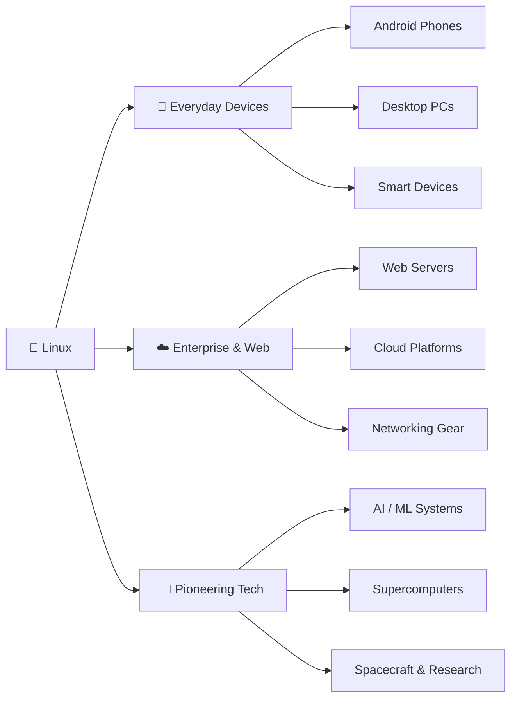
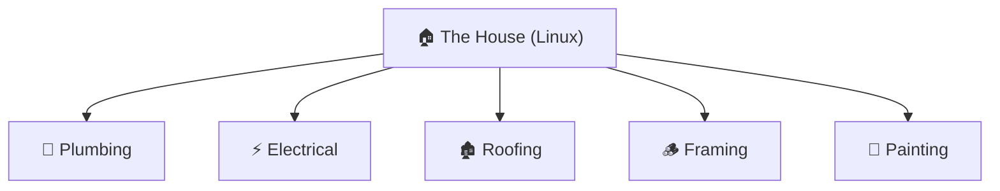
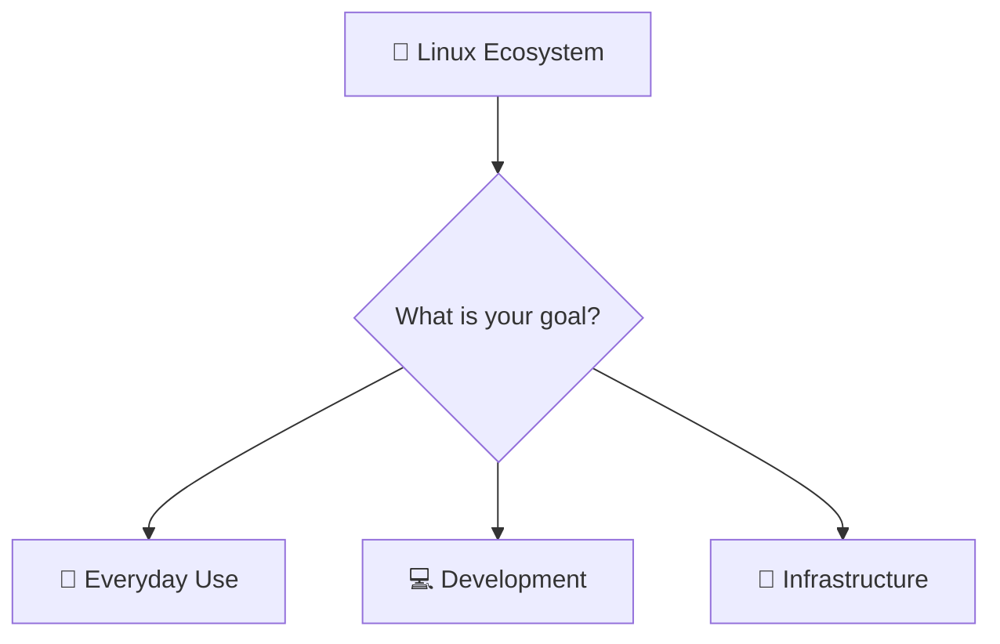

# 🐧 The Linux Big Picture
### *Before You Learn Linux, Understand It.*

> [!IMPORTANT]
> **"Linux is not one huge thing. It's a collection of smaller worlds. You only need to enter the world that matches your goal."**

---

## 1. What is Linux?

Most people think Linux is just another operating system like Windows. It isn't that simple.

Linux is an ecosystem that powers everything from phones and laptops to servers, supercomputers, and even spacecraft. It gives people the freedom to build, modify, and control their systems instead of being limited by a single company's decisions.

Linux isn't just software—it is a foundation on which thousands of modern technologies are built.

### ❓ Can I run all my Windows apps on Linux?

This is the very first thing most beginners worry about: *"Will I lose my favorite software?"*

The honest answer is: **not everything runs natively, but you won't feel left out.** 

*   **Same Apps:** Tools like Google Chrome, VS Code, Spotify, Discord, and Slack run **exactly** the same as they do on Windows.
*   **Power Alternatives:** For proprietary software like MS Office or Photoshop, Linux users use free, high-quality alternatives like LibreOffice (or Google Workspace) and GIMP.
*   **Gaming:** Gaming on Linux has changed completely. Thanks to Steam's Proton compatibility layer, you can now run thousands of Windows games natively on Linux with excellent performance.
*   **Windows-Only Apps:** If you absolutely need a Windows-only tool, compatibility layers like **WINE** can often run it directly, or you can run it inside a virtual machine (VM).

---

## 2. Why was Linux Created?

Before Linux, operating systems were closed, expensive, and controlled entirely by corporate gatekeepers. 

Linux was created with a revolutionary idea: 
> **Anyone should be able to study it, improve it, and share it freely.**

This single shift sparked the global **open-source movement**, transforming how humanity builds software.

---

## 3. Where is Linux Used?

This is where many beginners have their first surprise. Linux is almost everywhere.

When people hear "Linux," they often imagine a terminal window. In reality, you already interact with Linux every single day through your phone, the websites you visit, and the smart devices around you.

---

## 4. If Windows Works, Why Learn Linux?

This isn't about saying Windows is bad. Windows is an excellent tool for many use cases. The real question is: **Why do developers, AI engineers, cloud architects, and tech giants actively choose Linux?**

| Feature | Windows | Linux |
| :--- | :--- | :--- |
| 🎛️ **Control** | Proprietary; forced updates and background tracking. | Open source; you control every byte and service. |
| 💻 **Development** | Often requires heavy layers (WSL) to run developer tools. | Native environment for coding, compilation, and scripting. |
| ☁️ **Cloud & Servers** | Licensing costs; heavier resource usage. | Lightweight, free, and the native home of Docker & Kubernetes. |
| 🤖 **AI & ML** | Secondary support for some bleeding-edge ML libraries. | Native standard for GPU acceleration, PyTorch, and CUDA. |

You don't learn Linux because other tools are "wrong." You learn Linux because it is the most powerful tool for solving modern computing problems.

---

## 5. Don't Try to Build the Whole House

Imagine Linux is a house. 

Looking at the entire house at once feels impossible. There is framing, plumbing, roofing, electrical wiring, flooring, painting, and interior design. No one tries to learn all of these trades in a single day. Instead, they choose a path and specialize.

Linux works the same way:
*   **Trying to learn everything at once** leads to frustration and giving up.
*   **Choosing your path** removes the noise and makes learning enjoyable.

---

## 6. The Linux Ecosystem
s
Linux is structured like a tree, branching out based on distinct use cases rather than a single linear path.

### The Three Branches Explained

*   **📱 Everyday Use:**
    *   *What it is:* Using a privacy-focused daily driver with standard desktop environments and GUI apps (browsers, office suites, tools).
*   **💻 Development:**
    *   *What it is:* Writing code, working inside terminal shells, version control with Git, and configuring python/machine-learning environments.
*   **🔌 Infrastructure:**
    *   *What it is:* Running and securing background servers, managing databases, systemd service automation, and deploying network tools.

---

## 7. Choose Your Journey

To clear the path ahead, ask yourself: **"What do I want Linux to help me do?"**

*   **🤖 "I want to build AI and software projects."**
    *   *Your focus:* Command Line (CLI), package management, Git, Docker, Python environments.
*   **🤝 "I want to contribute to open source."**
    *   *Your focus:* Git pipelines, code compilers, project directories, documentation.
*   **🏗️ "I want to manage servers and secure systems."**
    *   *Your focus:* Networking, SSH key management, systemd background services, permissions.
*   **💻 "I just want a fast, customized desktop."**
    *   *Your focus:* Desktop environments, basic terminal navigation, customization themes.

---

## 🌌 8. The Philosophy

> [!TIP]
> **Linux isn't difficult because it's complex. It feels difficult because beginners see the entire ecosystem before choosing their own trail.**
>
> Our goal is not to force you to learn everything. Our goal is to give you a clear map, help you find your direction, and help you take the first steps with confidence.
