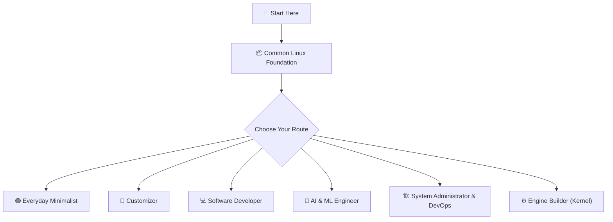
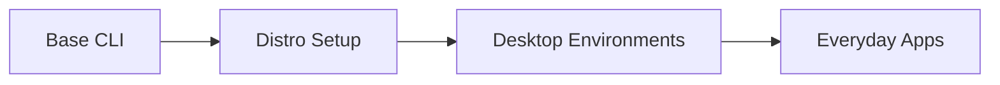
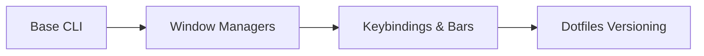
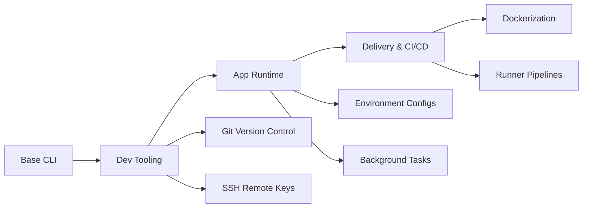
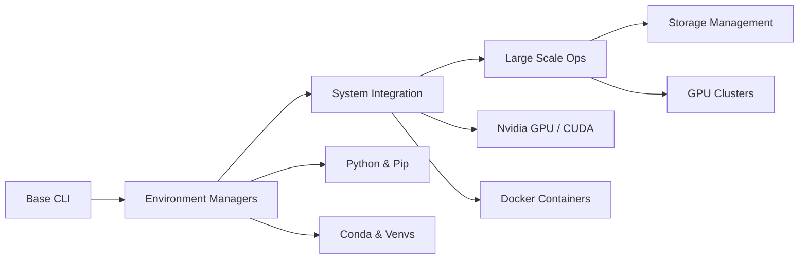
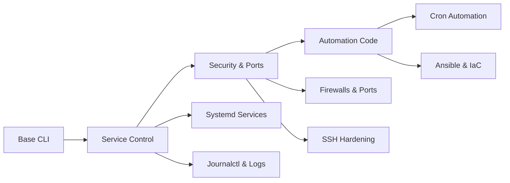
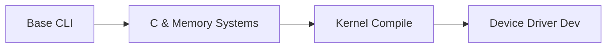

# 🗺️ The Linux Roadmap: Find Your Route

Now that you have read [The Spark (File 1)](file:///home/harsha/projects/foss-club/spark.md) and identified your path, it is time to look at your actual map. 

> [!IMPORTANT]
> **"Clarity before Complexity. Don't learn everything—learn what matters for your journey."**
> 
> *"Linux is not one huge thing. It's a collection of smaller worlds. You only need to enter the world that matches your goal."*

### 🔥 Igniting the Fire: Our Philosophy

This roadmap is a guide, but **a map cannot light a fire.** 

Our goal is not to make you memorize dry terminal command lists or systemd configurations. Our goal is to **ignite your curiosity**. Once you are curious and understand where you fit in the ecosystem, you will walk the path on your own. This file cannot carry that spark—you have to.

This is our core **Learning OS** for everything we build and study:
1.  **Collapse the surface area:** Strip away the massive scope of the subject.
2.  **Find your trail:** Focus only on what is needed for today's goal.
3.  **Ignore the rest:** Actively discard the noise.

---

## 🧭 The Core Architecture

Every learning path starts at the same root, builds a common foundation, and then branches out into career-specific skills.

---

## 📦 Stage 1: The Common Foundation

> [!IMPORTANT]
> **No matter your career choice, everyone starts here.** 
> You must get comfortable navigating the system using text. Spend 1-2 weeks here before branching out.
>
> Head over to [Phase 2: Build Your Linux Foundation](file:///home/harsha/projects/foss-club/phase2.md) to start hands-on learning for these common skills.

| Skill Area | Core Commands / Concepts | Milestone |
| :--- | :--- | :--- |
| **📁 File System Navigation** | `pwd`, `ls`, `cd`, `mkdir`, `rmdir` | Navigate files without clicking folders. |
| **🛠️ File Manipulation** | `touch`, `cp`, `mv`, `rm`, `cat`, `less` | Create, copy, move, and edit small files. |
| **✏️ Text Editing** | `nano` (but Vim eventually for sure) | Open, write to, and save configuration files. |
| **🔑 Permissions** | `chmod`, `chown`, basic read/write/execute | Understand why `Permission Denied` happens and fix it. |
| **📦 Package Management** | `apt install`, `dnf install` (depending on OS) | Install, update, and remove system software. |

---

## ⚡ Stage 2: The 6 Career Paths

Choose the path you selected in File 1 and follow its steps.

---

### 🟢 1. The Everyday Minimalist

#### 🟢 Foundation
*   **Concepts:** Installing a user-friendly, stable distribution inside a Virtual Machine or on secondary hardware.
*   **Skills to Learn:** Downloading ISOs, flashing USB drives, using basic setup tools on distros like Linux Mint or Fedora.

#### 🟡 Intermediate
*   **Concepts:** Graphical package configuration, installing and updating applications safely.
*   **Skills to Learn:** Finding applications via software hubs, managing background software sources, package repositories.

#### 🔴 Advanced
*   **Concepts:** Maintaining custom system backups, automating general OS security patches.
*   **Skills to Learn:** System recovery tools (Timeshift), executing automated visual updater scripts.

---

### 🎨 2. The Customizer

#### 🟢 Foundation
*   **Concepts:** Swapping standard command terminal emulators, setting custom command prompts.
*   **Skills to Learn:** Customizing terminal tools (Alacritty/Kitty), theme files, using shell addons (Oh-My-Zsh).

#### 🟡 Intermediate
*   **Concepts:** Lightweight visual environments, hotkey layouts, system status panels.
*   **Skills to Learn:** Installing tiling window managers (i3wm/Hyprland), configuring status panels, managing wallpaper daemons.

#### 🔴 Advanced
*   **Concepts:** Syncing custom configurations across multiple systems.
*   **Skills to Learn:** Creating and tracking config files in git repositories ("dotfiles"), custom desktop widgets.

---

### 💻 3. The Software Developer

#### 🟢 Foundation
*   **Concepts:** Version control navigation, managing code directories, writing simple automation scripts.
*   **Skills to Learn:** `git init/add/commit`, environment setup, basic shell scripts (`chmod +x script.sh`).

#### 🟡 Intermediate
*   **Concepts:** Secure remote servers, background execution, managing variables.
*   **Skills to Learn:** SSH key generation, editing system environment configurations (`.bashrc` / `.zshrc`), managing active tasks (`ps`, `kill`, `top`).

#### 🔴 Advanced
*   **Concepts:** Pipeline runners, local container builds, deployment environments.
*   **Skills to Learn:** Dockerfiles, writing automated build scripts, configuring pipeline configurations.

---

### 🤖 4. The AI / ML Engineer

#### 🟢 Foundation
*   **Concepts:** Installing Python environment managers, configuring virtual environments, managing dependency packages.
*   **Skills to Learn:** `pip`, `venv`, `conda`, managing environmental variables (`PATH`, `CUDA_PATH`).

#### 🟡 Intermediate
*   **Concepts:** Running workloads in background screens, containerizing experiments, configuring GPU drivers.
*   **Skills to Learn:** `screen` / `tmux`, `docker run` commands, checking GPU usage with `nvidia-smi`.

#### 🔴 Advanced
*   **Concepts:** Remote server execution, disk partition handling for huge datasets, clusters.
*   **Skills to Learn:** SSH key forwarding, mounting external drives (`mount`, `fstab`), running jobs in headless environments.

---

### 🏗️ 5. The System Administrator & DevOps

#### 🟢 Foundation
*   **Concepts:** Controlling background software services, examining system logs, troubleshooting crashes.
*   **Skills to Learn:** `systemctl start/stop/restart`, reading logs via `journalctl -u service_name`.

#### 🟡 Intermediate
*   **Concepts:** Local networking, securing connections, automation.
*   **Skills to Learn:** User management (`useradd`, `usermod`), port diagnostics (`netstat`, `ss`), firewall controls (`ufw` or `iptables`).

#### 🔴 Advanced
*   **Concepts:** Automated provisioning, server hardening, scheduling.
*   **Skills to Learn:** Shell scripting with arrays and loops, writing configuration automation (Ansible/Chef), configuring automatic backup tasks (`cron`).

---

### ⚙️ 6. The Engine Builder (Kernel Developer)

#### 🟢 Foundation
*   **Concepts:** Compiling C applications, tracking repository source changes.
*   **Skills to Learn:** Code build setups (gcc, make), downloading kernel repository code trees.

#### 🟡 Intermediate
*   **Concepts:** Custom compilation parameters, compiling system drivers.
*   **Skills to Learn:** Modifying boot profiles, kernel configuration setups (`make menuconfig`), compiling kernel files.

#### 🔴 Advanced
*   **Concepts:** Writing loadable helper modules, reading live memory outputs.
*   **Skills to Learn:** Developing Loadable Kernel Modules (LKMs), deploying driver code, tracing memory allocations (`dmesg`, `lsmod`).

---

## 🏆 How to Know You are Ready

You don't need a certificate. Test yourself with these milestones:

> [!TIP]
> **Level 1 Milestone:** You can open your computer, create a script file, write a 3-line backup script, and run it purely inside the terminal without opening a graphical window.
> 
> **Level 2 Milestone:** When an application crashes, you do not reinstall it. Instead, you check system logs, identify the error, change the configuration file, and restart the service.
> 
> **Level 3 Milestone:** You can set up your entire environment on a fresh machine in under 10 minutes using a git repository of your custom settings and scripts.
